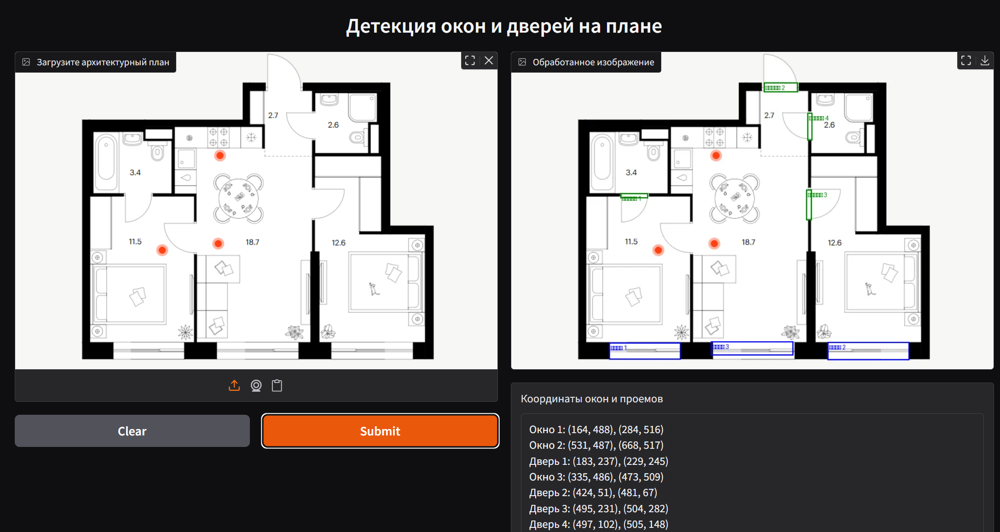

# 🚪 Floorplan Openings — Обнаружение окон и дверей на архитектурных планах

[](https://www.python.org/) [](https://www.docker.com/) [](https://gradio.app/) [](https://github.com/ultralytics/ultralytics)

> **Автоматическое извлечение координат дверных и оконных проемов на архитектурных планах с помощью сегментации и компьютерного зрения**

---

## 📌 О проекте

**Floorplan Openings** — система компьютерного зрения, которая:
- Принимает на вход изображение архитектурного плана.
- Использует модель сегментации YOLO для детекции дверей и окон.
- Возвращает аннотированное изображение с выделенными проемами и их координатами.

Система предназначена для подготовки данных для 3D-визуализации.

---

## 🚀 Ключевые возможности

* 🚪 **Детекция проемов:** высокоточная сегментация дверей и окон даже на сложных планах.
* 🖼 **Визуализация:** аннотированные изображения с выделенными объектами.
* 📄 **Экспорт данных:** координаты границ проемов для дальнейшего анализа и интеграции.
* ⚡ **Gradio-интерфейс:** простой способ загрузки изображения и просмотра результата.
* 🐳 **Контейнеризация:** быстрая установка и запуск через Docker.

---

## 🏗 Архитектура и стек технологий

**Стек:** Python 3.10, Docker, Gradio, Ultralytics YOLO

| Компонент           | Технологии                                  |
|---------------------|---------------------------------------------|
| Детекция проемов    | YOLOv11s-seg                  				|
| Интерфейс           | Gradio                                      |
| Контейнеризация     | Docker                                      |

---

## 📋 Требования

* Python 3.10
* Docker >= 20.10
* NVIDIA GPU (опционально)
* Обученная модель YOLO в формате `.pt`
* Зависимости из `requirements.txt`:
	- torch==2.7.1
	- torchvision
	- pillow
	- gradio==5.35.0
	- ultralytics==8.3.162

---

## ⚙️ Установка

1. **Клонируйте репозиторий:**
   ```bash
   git clone https://github.com/SubLieDie/floorplan_openings.git
   cd floorplan_openings
   ```
   
2. **Поместите обученную модель в папку Docker/ под именем model.pt.**

3. **Соберите Docker-образ:**  
    ```bash
	docker build -t floorplan_openings .
	```
4. **Запустите контейнер:**
	
	**С GPU:**
	```bash
	docker run --gpus all -p 7860:7860 floorplan_openings
	```
	**Без GPU:**
	```bash
	docker run -p 7860:7860 floorplan_openings
	```
	
5. **Перейдите в браузере по адресу:**
	[http://localhost:7860](http://localhost:7860)

---


	
---

	
## 💡 Использование

1. Запустите приложение через Docker (см. раздел [Установка](#-установка)).
2. Загрузите изображение архитектурного плана через веб-интерфейс.
3. Получите:
	- Аннотированное изображение с окнами и дверями.
	- Координаты каждого проема в виде (x1, y1), (x2, y2).

---

## 📁 Структура проекта
```
floorplan_openings/
├── Docker/
│   ├── Dockerfile
│   ├── requirements.txt
│   ├── app.py
│   ├── model.pt              
├── screenshot.png
├── README.md
└── .gitignore
```

---

##  ✉️ Контакты и поддержка
**Автор:** Петр Ростокин
 
* Telegram: [SubLieDie](https://t.me/subliedie)  
* GitHub: [SubLieDie](https://github.com/subliedie)  


---