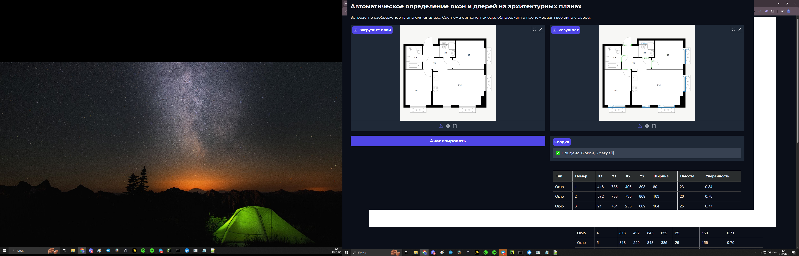

# 🚪 Floorplan Openings — Обнаружение окон и дверей на архитектурных планах

[](https://www.python.org/) [](https://www.docker.com/) [](https://gradio.app/) [](https://github.com/ultralytics/ultralytics)

**Автоматическое обнаружение окон и дверей на архитектурных планах** с использованием YOLOv8 и интерактивным веб-интерфейсом.

---

## 📌 О проекте

**Floorplan Openings** — система компьютерного зрения, которая:
- Принимает на вход изображение архитектурного плана.
- Использует модель сегментации YOLO для детекции дверей и окон.
- Возвращает аннотированное изображение с выделенными проемами и их координатами.

Система предназначена для подготовки данных для 3D-визуализации.

---

## ✨ Особенности

- 🖼️ **Высокая точность** - модель обучена на специализированном датасете архитектурных планов
- 🚀 **Быстрая обработка** - анализ планов в реальном времени
- 📊 **Детальная аналитика** - таблицы с координатами и размерами элементов
- 💾 **Экспорт результатов** - сохранение в PNG, CSV и JSON форматах (поддерживается сохранение .zip)
- 🌐 **Удобный интерфейс** - интуитивно понятный веб-интерфейс на Gradio

---

## 🏗 Архитектура и стек технологий

**Стек:** Python 3.10, Docker, Gradio, Ultralytics YOLO

| Компонент           | Технологии                                  |
|---------------------|---------------------------------------------|
| Детекция проемов    | YOLO11l-seg                  				|
| Интерфейс           | Gradio                                      |
| Контейнеризация     | Docker                                      |

---

## 📋 Требования

* Python 3.10
* Docker >= 20.10
* NVIDIA GPU (опционально)
* Обученная модель YOLO в формате `.pt`
* Зависимости из `requirements.txt`:
	- torch==2.7.1
	- torchvision
	- pillow
	- gradio==5.35.0
	- ultralytics==8.3.162
	- lxml>=4.9.0
    - html5lib>=1.1
    - beautifulsoup4>=4.12.0

---

## ⚙️ Установка

1. **Клонируйте репозиторий:**
   ```bash
   git clone https://github.com/SubLieDie/floorplan_openings.git
   cd floorplan_openings
   ```
   
2. **Поместите обученную модель в папку Docker/ под именем model.pt.**

3. **Соберите Docker-образ:**  
    ```bash
	docker build -t floorplan_openings .
	```
4. **Запустите контейнер:**
	
	**С GPU:**
	```bash
	docker run --gpus all -p 7860:7860 floorplan_openings
	```
	**Без GPU:**
	```bash
	docker run -p 7860:7860 floorplan_openings
	```
	
5. **Перейдите в браузере по адресу:**
	[http://localhost:7860](http://localhost:7860)

---

## 📷 Примеры работы



**Экспорт результатов**

---

## 🧠 Модель и обучение
**Архитектура:** YOLO11l-seg (сегментация)

**Датасет:** 1500+ размеченных архитектурных планов

**Метрики:**

**mAP50 (двери):** 0.84

**mAP50 (окна):** 0.82

**Precision:** 0.85

**Recall:** 0.80
	
## 💡 Использование

**Расширенный функционал:**
1. **Запустите приложение через Docker** (см. раздел [Установка](#-установка)).
2. **Загрузка планов:**
	- Поддержка форматов: JPG, PNG, JPEG
	- Drag-and-drop интерфейс
3. **Анализ результатов:**
	- Интерактивное аннотированное изображение с элементами:
		- 🟢 Зеленые контуры - двери (с нумерацией)
		- 🔵 Синие контуры - окна (с нумерацией)
	- Детальная таблица параметров для каждого элемента.
		- Тип	Номер	X1	Y1	X2	Y2
		
4. **Экспорт данных:**
	- Скачивание обработанного изображения (PNG/JPEG)
	- Выгрузка таблицы в CSV/Excel
	- Генерация JSON-отчета с полными метаданными
	- Автоматическое сохранение результатов в папку ./results
	
**Пример вывода координат:**
| Тип   | Номер | X1  | Y1  | X2  | Y2  |Ширина  | Высота | Уверенность |
|-------|-------|-----|-----|-----|-----|--------|--------|-------------|
| Окно  | 1     | 416 | 785 | 496 | 808 |80      | 23     | 0.84        |
| Дверь | 1     | 425 | 746 | 346 | 124 |2       | 15     | 0.77        |

---

## 📁 Структура проекта
```
floorplan_openings/
├──fonts/
│   ├── Arial.ttf
├──.gitattributes
├── Dockerfile
├── README.md
├── app.py
├── example1.jpg
├── example2.png
├── export_example.png
├── favicon.ico.png
├── model.pt
├── requirements.txt
└──  work_example.png

```
---
## 📜 История версий модели
### Версия 1.0 (начальная)
**Проблемы:**

- Низкое качество детекции дверей (mAP50: 0.42)
- Ложные срабатывания на стены

**Пример метрик:**

# Основные метрики по эпохам:
| Epoch | Train Box Loss | Val Box Loss | mAP50 (B) |   Изменение   |
|-------|----------------|--------------|-----------|---------------|
|   1   |   2.78432      |   2.80791    |  0.22248  |     Baseline   |
|   10  |   2.20618      |   2.26652    |  0.49908  |  ↑ +124.3% 🚀  |
|   20  |   2.06998      |   2.19091    |  0.51759  |  ↑ +132.6% 🔥  |


[📉 Loss] 2.78 → 2.07 (-25.6%) 

[📊 mAP50] 0.22 → 0.52 (+136%)

### Версия 2.0 (Оптимизированная)

| Epoch | Train Box Loss | Val Box Loss | mAP50 (B) |  Динамика  |
|-------|----------------|--------------|-----------|------------|
|   1   |   0.13475      |   0.22155    |  0.83335  |  Baseline  |
|   10  |   0.13177      |   0.22104    |  0.84034  |  ↑ +0.8% ✅ |
|   20  |   0.12862      |   0.23331    |  0.82847  |  ↓ -1.4% ⚠️ |

**Сравнение версий:**
[🆚 mAP50] V1: 0.52 → V2: 0.83 (+59.6%)

[⚡ Скорость] V1: 9s/img → V2: 3s/img (-66%)

---

## 🤝 Как внести вклад
1. Форкните репозиторий
2. Создайте ветку для вашей фичи (git checkout -b feature/AmazingFeature)
3. Сделайте коммит изменений (git commit -m 'Add some AmazingFeature')
4. Запушьте ветку (git push origin feature/AmazingFeature)
5. Откройте Pull Request

---

## 📜 Лицензия
Распространяется под лицензией MIT.

---
##  ✉️ Контакты и поддержка
**Автор:** Петр Ростокин
 
* Telegram: [SubLieDie](https://t.me/subliedie)  
* GitHub: [SubLieDie](https://github.com/subliedie)  
* Проект: [floorplan_openings](https://github.com/SubLieDie/floorplan_openings)

---